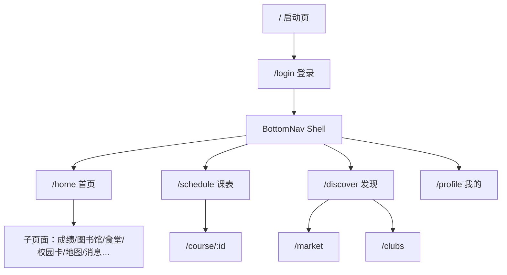

# 校园生活服务 App

前后端分离：Flutter 移动端 + Node.js（SQLite）后端。

## 目录结构

```
12-flutter-campus-life/
├── mobile/          # Flutter App（24 页）
├── backend/         # Node.js API
├── assets/mock/     # 种子数据 JSON
└── prompt.md        # 需求说明
```

## 快速开始

### 1. 启动后端

```bash
cd backend
npm install
npm start
```

- API：`http://localhost:3001/api`
- 健康检查：`http://localhost:3001/health`
- 演示账号：`20210001` / `123456`

### 2. 启动 Flutter（Web）

```bash
cd mobile
flutter pub get
flutter run -d chrome --web-port=5173
```

指定 API 地址：

```bash
flutter run -d chrome --dart-define=API_BASE_URL=http://localhost:3001
```

Android 模拟器请使用 `http://10.0.2.2:3001`。

## 页面路由



## 功能概览

| 模块 | 说明 |
|------|------|
| 课表 | 周视图切换、自定义加课 |
| 成绩 | 学期 GPA 加权计算 |
| 图书馆 | 借书上限 5 本、续借 1 次 |
| 校园卡 | 余额、流水筛选、Mock 充值、付款码 |
| 失物招领 | 寻物/招领 Tab、发布 |
| 二手 | 收藏、举报、浏览历史 |
| 地图 | OSM 瓦片 + 11 个 POI |
| 搜索 | 跨课程/图书/二手 |

## 测试

```bash
# Flutter 单元测试
cd mobile && flutter test

# 后端测试
cd backend && npm test
```

## 技术栈

| 端 | 技术 |
|----|------|
| 移动端 | Flutter, Riverpod, go_router, Hive, flutter_map, qr_flutter |
| 后端 | Node.js, Express, better-sqlite3 |
| 数据库 | SQLite |
